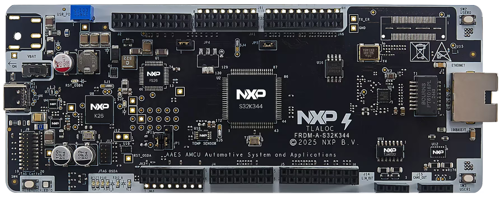

# NXP Application Code Hub

## UART Communication Example using RTD Drivers on FRDM-A-S32K344
This demo shows how to configure and use the LPUART driver from the RTD package on the FRDM-A-S32K344 using S32 Design Studio.
It implements a UART-based command interface to control and monitor the green LED, with additional button input support and visual feedback via LEDs, demonstrating UART communication and GPIO interaction.

#### Boards: FRDM-A-S32K344
#### Categories: Communication
#### Peripherals: UART, FLEXIO
#### Toolchains: S32 Design Studio IDE

## Table of Contents
1. [Software and Tools](#step1)
2. [Hardware](#step2)
3. [Setup](#step3)
4. [Results](#step4)
5. [Support](#step5)
6. [Release Notes](#step6)

## 1. Software and Tools
This example was developed using the FRDM Automotive Bundle for S32K3 + S32M27. To download and install the complete software and tools ecosystem, use the following link:
- [FRDM Automotive S32K3 + S32M27 Board Installation Package](https://www.nxp.com/app-autopackagemgr/automotive-software-package-manager:AUTO-SW-PACKAGE-MANAGER?currentTab=0&selectedDevices=S32K3&applicationVersionID=203)

## 2. Hardware

- Personal Computer
- Type-C USB cable
- [FRDM-A-S32K344](https://www.nxp.com/design/design-center/development-boards-and-designs/FRDM-A-S32K344)[

](images/FRDM-A-S32K344.png)

## 3. Setup

### 3.1 Import the Project into S32 Design Studio IDE
1. Open S32 Design Studio IDE, in the Dashboard Panel, choose **Import project from Application Code Hub**.
[

](./images/import_project_1.png)

2. Find the demo you need by searching for the name directly. 
Open the project, click on the **GitHub link**, S32 Design Studio IDE will automatically retrieve project attributes, then click **Next>**.
[

](./images/import_project_3.png)

3. Select **main** branch and then click **Next>**.
4. Select your local path for the repo in the **Destination->Directory** window. The S32 Design Studio IDE will clone the repo into this path, click **Next>**.

5. Select **Import existing Eclipse projects** then click **Next>**.

6. Select the project in this repo (only one project in this repo) then click **Finish**.
### 3.2 Generating, Building and Running the Example
1. In Project Explorer, right-click the project and select **Update Code and Build Project**. This will generate the configuration (Pins, Clocks, Peripherals), update the source code and build the project using the active configuration (e.g. Debug_FLASH).
Make sure the build completes successfully and the *.elf file is generated without errors.
[

](./images/update_and_build.png)
Press **Yes** in the **SDK Component Management** pop-up window to continue.

2. Go to **Debug** and select **Debug Configurations**. There will be a debug configuration for this project:
[

](./images/Debug_config.png)

        Configuration Name                  Description
        -------------------------------     -----------------------
        $(example)_debug_flash_pemicro      Debug the FLASH configuration using PEmicro probe

    Select the desired debug configuration and click on **Debug**. Now the perspective will change to the **Debug Perspective**.
    Use the controls to control the program flow.

## 4. Results

This example validates UART communication through interaction with a serial terminal. Open a terminal on the detected COM port using the following settings:
- **Baud rate:** 115200  
- **Data bits:** 8  
- **Parity:** None  
- **Stop bits:** 1  
- **Flow control:** None  

After reset, the board sends a welcome message and displays a command prompt. The user can enter commands such as:
- `help`
- `led on`
- `led off`
- `status`

Commands are received via UART, processed by the application, and responses are sent back over the same interface, confirming correct UART transmit and receive operation.

The **green LED** can be controlled both from UART commands and from onboard buttons (SW2 and SW3), while the **blue LED** briefly blinks to indicate UART activity.

Internally, the application continuously reads incoming UART data byte-by-byte, builds a command buffer, and executes the command when the Enter key is pressed. Based on the parsed input, the system updates GPIO outputs and transmits a response back to the terminal.

## 5. Support
For general technical questions related to NXP microcontrollers, please use the *NXP Community Forum*.
#### Project Metadata

<!----- Boards ----->

<!----- Categories ----->

<!----- Peripherals ----->

<!----- Toolchains ----->

Questions regarding the content/correctness of this example can be entered as Issues within this GitHub repository.

>**Warning**: For more general technical questions regarding NXP Microcontrollers and the difference in expected functionality, enter your questions on the [NXP Community Forum](https://community.nxp.com/)

## 6. Release Notes
| Version | Description / Update                           | Date                        |
|:-------:|------------------------------------------------|----------------------------:|
| 1.0     | Initial release on Application Code Hub        |June 5th 2026     |
| 1.1     | Updated to FRDM Automotive S32K3 + S32M27 (RTD 7.0.1)        |August 25th 2026|
